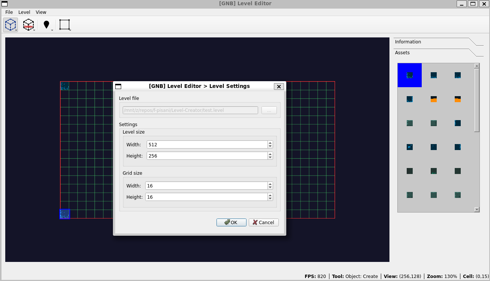

# Level Creator

<p align="center">
  
</p>

A 2D level editor built with Qt5 and SFML, designed for game development. This is an old hobby project created around 2015 that provides a visual interface for designing game levels with various elements like art objects, colliders, markers, and triggers.

## Overview

Level Creator is a graphical tool that allows game developers to:
- Place and manage art objects (sprites/graphics)
- Define collision boundaries 
- Set spawn points and waypoints using markers
- Create trigger zones for game events
- Export levels in a custom binary format

The editor features a grid-based design system with tools for selecting, creating, and removing different level elements.

## Features

- **Visual Level Design**: Grid-based editor with intuitive drag-and-drop interface
- **Multiple Element Types**: 
  - Art Objects for visual elements
  - Colliders for physics boundaries
  - Markers for positions (spawn points, waypoints)
  - Triggers for event zones
- **Asset Management**: Custom DAT container format for managing game assets
- **Custom File Format**: Binary .level files for efficient level storage
- **Qt/SFML Integration**: Combines Qt widgets for UI with SFML for rendering

## Requirements

- **C++ Compiler**: g++ with C++11 support
- **Qt5**: Core, Gui, and Widgets modules
- **SFML 2.x**: graphics, window, system, audio, and network libraries
- **Build Tools**: GNU Make and pkg-config

### Installing Dependencies

#### Ubuntu/Debian
```bash
sudo apt-get install g++ make pkg-config
sudo apt-get install qt5-default qtbase5-dev
sudo apt-get install libsfml-dev
```

#### Fedora/RHEL
```bash
sudo dnf install g++ make pkg-config
sudo dnf install qt5-qtbase-devel
sudo dnf install SFML-devel
```

#### macOS (using Homebrew)
```bash
brew install qt5 sfml pkg-config
```

## Building

1. Clone the repository:
```bash
git clone https://github.com/f-pisani/Level-Creator.git
cd Level-Creator
```

2. Build the project:
```bash
make
```

3. For a debug build:
```bash
make debug
```

## Running

After building, run the level creator:
```bash
make run
```

Or directly:
```bash
./build/level-creator
```

## Usage

1. **Creating Objects**: Select the appropriate tool from the toolbar (Object, Collider, Marker, or Trigger) and click "Create" mode
2. **Placing Elements**: Click on the grid to place elements at desired positions
3. **Selecting Elements**: Switch to "Select" mode to modify existing elements
4. **Removing Elements**: Use "Remove" mode to delete unwanted elements
4. **Managing Assets**: Use the Assets Manager to import and organize game sprites
5. **Saving Levels**: Export your level design to a .level file

## Project Structure

- `/Engine/` - Core level data structures and serialization
- `/Editor.*` - Main editor logic and viewport
- `/GUI*.* ` - Qt-based user interface components
- `/QSFML/` - Qt and SFML integration layer
- `/DAT/` - Custom asset container implementation
- `/data/` - Editor icons and resources
